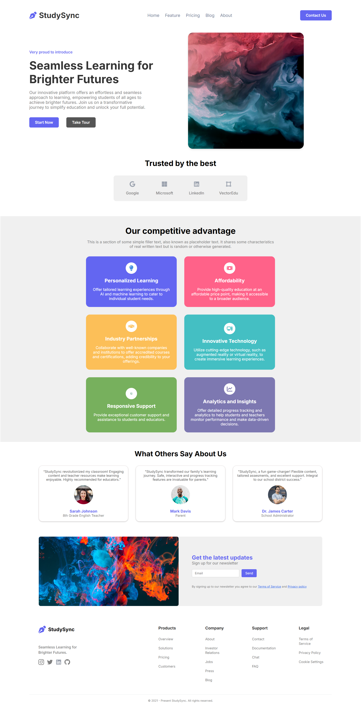

# 📚 StudySync - Responsive Educational Landing Page

<p align="center">
  A modern, responsive, and visually appealing educational landing page built using pure HTML5 and CSS3.
</p>

<p align="center">
  
  
  
  
</p>

---

## ✨ Overview

StudySync is a responsive educational landing page inspired by a modern EdTech website.

The project demonstrates the use of modern HTML and CSS techniques to create a clean, responsive, and user-friendly interface without using any CSS frameworks or JavaScript.

---

## 🚀 Features

- ✅ Fully Responsive Design
- ✅ Modern UI/UX
- ✅ Semantic HTML5 Structure
- ✅ CSS Flexbox Layout
- ✅ CSS Grid Layout
- ✅ Smooth Hover Effects
- ✅ Animated Hero Section
- ✅ Testimonials Section
- ✅ Newsletter Subscription Section
- ✅ Professional Footer
- ✅ Mobile Friendly

---

## 📸 Preview

<p align="center">
  
</p>

---

## 🛠️ Tech Stack

| Technology | Usage |
|------------|-------|
| HTML5 | Structure |
| CSS3 | Styling |
| Flexbox | Layout |
| CSS Grid | Responsive Cards |
| Media Queries | Responsive Design |
| CSS Animations | Hero Section Animation |

---

## 📂 Project Structure

```text
StudySync/
│
├── images/
│   ├── logo.svg
│   ├── hero-image.jpg
│   ├── social-icons
│   └── other assets
│
├── index.html
├── style.css
├── preview.png
├── LICENSE
└── README.md
```

---

## 💡 What I Learned

While building this project, I gained hands-on experience with:

- Writing semantic HTML
- Building responsive layouts
- CSS Flexbox
- CSS Grid
- Positioning elements
- Media Queries
- CSS Variables
- Hover Animations
- Professional project organization

---

## 🎯 Future Improvements

- Add JavaScript functionality
- Dark Mode
- Smooth Scroll Navigation
- Contact Form Validation
- Backend Integration
- Deploy on Vercel/Netlify

---

## 🌐 Live Demo

> **https://study-sync-website-frontend-clone-90oukd3fy-hackhorizon.vercel.app**

---

## 📥 Installation

Clone the repository

```bash
git clone https://github.com/yourusername/StudySync-Website-Frontend-Clone.git
```

Navigate into the project

```bash
cd StudySync-Website-Frontend-Clone
```

Open `index.html` in your browser.

---

## 👨‍💻 Author

**Ayan Kundu**

- GitHub: https://github.com/ayankunduixb-pixel
- LinkedIn: https://www.linkedin.com/in/ayan-kundu-389737397

---

## ⭐ Support

If you like this project, consider giving it a ⭐ on GitHub!

---

## 📄 License

This project is licensed under the MIT License.